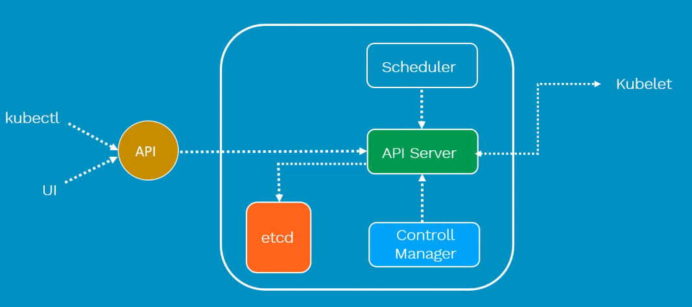
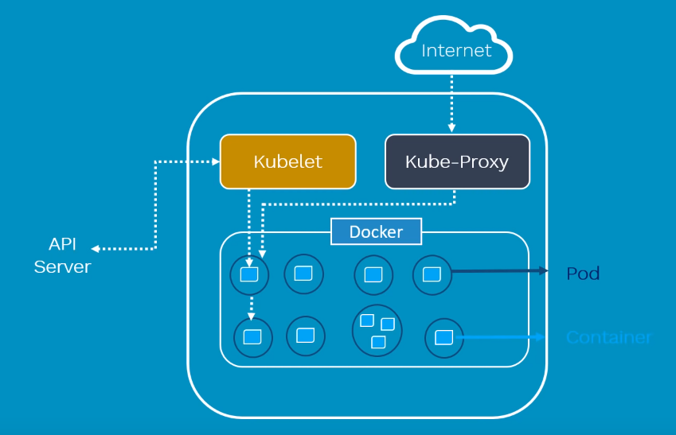

# Kubernetes Basics

This folder introduces the core Kubernetes objects you need before moving into configuration, storage, scheduling, services, and security.

## Map

- [Cluster architecture](cluster.md)
- [kubectl basics](kubectl/README.md)
- [kubectl operations and selectors](kubectl/operations.md)
- [Controllers overview](controllers/README.md)
- [Example manifests](controllers/examples)

## Why Kubernetes?

Containers package an application process with the dependencies it needs. They are fast to start, portable, efficient, and easy to scale, but a real environment needs orchestration around them.

Kubernetes provides:

- Declarative deployment of containerized applications.
- Scheduling across a group of machines.
- Self-healing when Pods or nodes fail.
- Horizontal scaling.
- Service discovery and load balancing.
- Rollouts and rollbacks for application updates.

## Architecture

A Kubernetes cluster has a control plane and one or more worker nodes.

### Control Plane

The control plane stores cluster state and decides what should run where.

| Component | Purpose |
| --- | --- |
| `kube-apiserver` | Exposes the Kubernetes API and validates requests for objects such as Pods, Services, Deployments, and Namespaces. |
| `etcd` | Stores cluster state as a distributed key-value database. |
| `kube-scheduler` | Assigns newly created Pods to suitable nodes. |
| `kube-controller-manager` | Runs built-in controllers that reconcile the current cluster state with the desired state. |
| `cloud-controller-manager` | Integrates Kubernetes with cloud-provider APIs when the cluster runs on a cloud platform. |



### Worker Nodes

Worker nodes run the Pods scheduled by the control plane.

| Component | Purpose |
| --- | --- |
| `kubelet` | Runs on each node, starts Pods through the container runtime, and reports Pod and node status back to the API server. |
| `kube-proxy` | Maintains networking rules so Services can route traffic to Pods. It commonly uses iptables or IPVS on Linux. |
| Container runtime | Pulls images and runs containers. Common choices include `containerd` and Docker-compatible runtimes. |



## First Commands

```bash
kubectl cluster-info
kubectl get nodes
kubectl get namespaces
kubectl apply -f namespace.yml
kubectl apply -f controllers/examples/pod.yml
kubectl get pods -n dev
```

## Recommended Learning Order

1. Read [cluster.md](cluster.md) to understand what makes up a cluster.
2. Practice the commands in [kubectl/README.md](kubectl/README.md).
3. Apply [namespace.yml](namespace.yml) before examples that use the `dev` namespace.
4. Study [controllers/pod.md](controllers/pod.md), then move to Deployments, ReplicaSets, Jobs, CronJobs, and DaemonSets.
