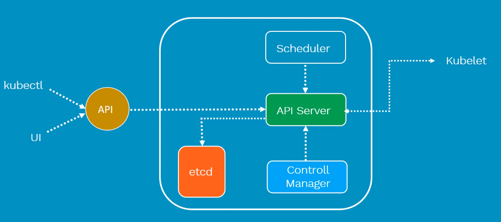

# Kubernetes

- Container design to do one thing, and it is: 
  - Faster
  - Reliable 
  - Efficient 
  - Light-weight 
  - Scalable 
- The fact that containers are scalable we need tool to manage them 
- Container Management tool which 
  - Automates container deployment
  - Container (de) scaling 
  - Container load balancing 

### Architecture

- Master/Salve architecture 
- ***Worker node*** contains 
  - **Pod**:
    - Scheduling unit in k8S
    - Consists of one or more containers (most cases one container)
  - **Container**: 
     - Runtime environment of an image 
     - Designed to run microservices applications
* ***Master***
  - Manages full cluster 
  - Monitor the healthcheck of nodes 
  -  Responsible for: 
    - Scheduling 
    - Provision
    - Controlling 
    - Exposing API to client 

 

### Components 

1. **Master**

- **API**
  - Acts as gate a keeper of the cluster
  - Actions (GET, DELETE, ...) go through the API
   
- **Kube-api-server**

It servers the Kubernetes API, the primary interface to the control plane and the cluster itself. 
When interacting with your Kubernetes cluster, you will usually do so using the Kubernetes API. 

  - Validates and configure API objects such as pods, services ...
  - Responsible for exposing various APIs

- **Etcd**
Is the backend data store for the Kubernetes cluster. It provides high-availability storage for all data relating to the
state of the cluster. 
  - Key-value distributed light-weight database
  - Stores current states of the cluster

- **kube-scheduler**

It handles scheduling, the process of selecting an available node in the cluster on which to run containers. 

- **kube-controller-manager**

It runs a collection of multiple controller utilities in a single process. These controllers carry out a variety of
automation-related tasks within the Kubernetes cluster. 
  - There are four controllers
    - Node controller
    - Replication controller
    - End-point Controller
    - Service controller
All controllers are responsible for health of cluster

- **cloud-controller-manager**

It provides an interface between Kubernetes and various cloud platforms. It is only used when using cloud-based
resources alongside Kubernetes.
    

 

### Nodes (Worker Nodes)

Kubernetes Nodes are the machines where the containers managed by the cluster run. A cluster can have any number 
of nodes. 
Various node components manage containers on the machine and communicate with the control plane. 

- **Kubelet**

It is the Kubernetes agent that runs on each node. It communicates with the control plane and ensure that containers are 
run on its node as instructed by control plane. 
Kubelet also handles the process of reporting container status and other data about containers back to the control plane. 

  - It is the Primary node engine that runs in worker node 
  - It ensures that containers inside Pods are running, if not it will try to restart pods in the same worker, and if 
the issue is du to worker itself it will try to start it in another worker node.

- **Kube-proxy**
Is a network proxy. It runs on each node and handles some tasks related to providing networking between containers 
and services in the cluster.
  - Maintains the entire internet configuration
  - Maintains networks distributed network across all nodes 

- **Container runtime**
The container runtime is not built into Kubernetes. It is a separate piece of software that is responsible foe actually 
running container on the machine. 
Kubernetes supports multiple container runtime implementations. The popular container runtimes are: 
  - Docker 
  - containerd

 

3. Tools to interact with API

- Kubectl
- Minikube
