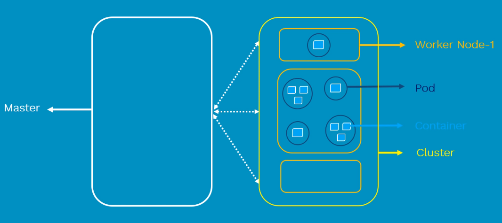
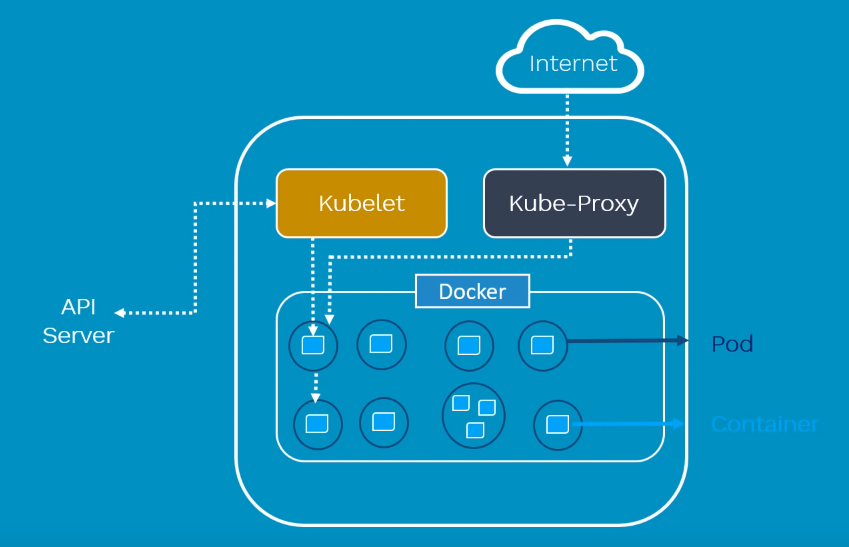

# Kubernates 
* Container design to do one think and it is: 
	* Faster
	* Reliable 
	* Efficient 
	* Light-weight 
	* Scalable 
* The fact that containers are scalable we need tool to manage them 

* Container Management tool which 
	* Autmates container deployment
	* Container (de) scaling 
	* Container load balancing 

### Architecture
* Master/Salve architecture 
* ***Worker node*** contains 
    * **Pod**:
        * Scheduling unit in k8S
        * Consists of one or more containers (most cases one container)
    * **Container**: 
        * Runtime environment of an image 
        * Designed to run microservices applications
* ***Master***
    * Manages full cluster 
    * Monitor the healthckech of nodes 
    * Responsible for: 
        * Scheduling 
        * Provisiong
        * Controlling 
        * Exposing API to client 

 

### Components 
1. **Master**
    * **API**
        * Acts as gate keeper of the cluser
        * Actions (GET, DELETE, ...) go throught the API
    * **API Server**
        * Validates and configure API objects such as pods, services ...
        * Responsible for exposing various APIs
    * **Scheduler**
        * Schedules Pods across multiple nodes
    * **Controll Manager**
        * There are four controllers
            * Node controller
            * Replication contoller
            * End-point Controller
            * Service controller
        * All controllers are responsible for health of cluster
    * **etcd**
        * Key-value distributed light-weight database
        * Stores current states of the cluster

 

2. **Worker**
    * **Kubelet**
        * Primary node engine that runs in worker node 
        * Ensure that containers inside Pods are running, if not it will try to retart pods in the same worker. If issue is du to worker itself it will try to start it in anthor worker
    * **Kube-proxy**
        * Maintains the entire internet configuration
        * Maintains networks distribued network across all nodes 
    * **Pods**
    * **Containers**

 

3. Tools to interact with API
    * Kubectl
    * Minikube
* hybrid,on-premise, and public cloud ??

